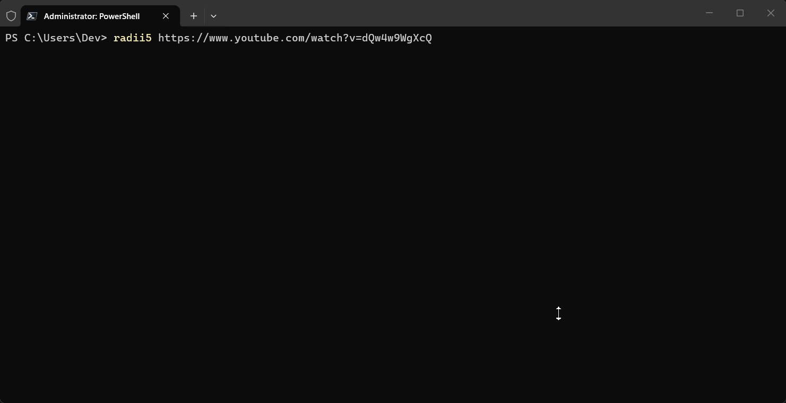
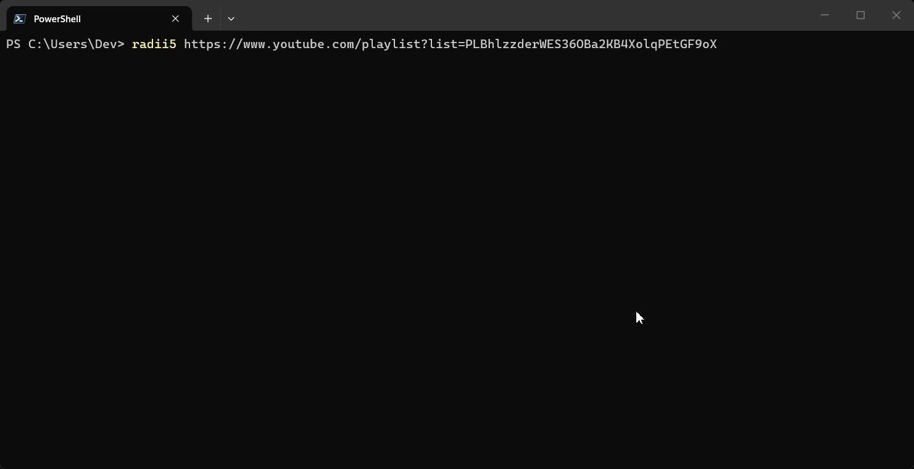

# radii5

[](https://github.com/ohcass/radii5/actions/workflows/ci.yml)

Single track:



Playlist:



## Install

**Windows**
```powershell
irm https://ohcass.github.io/radii5/install.ps1 | iex
```

**Linux / macOS**
```sh
curl -fsSL https://raw.githubusercontent.com/ohcass/radii5/main/scripts/install.sh | sh
```

<details>
<summary>Build from source</summary>

```sh
git clone https://github.com/ohcass/radii5.git
cd radii5
go build -o radii5 ./cmd/radii5/
```
</details>

### To remove

**Windows**
```powershell
Remove-Item "$env:USERPROFILE\.radii5\bin\radii5.exe"
```

**Linux / macOS**
```sh
rm ~/.radii5/bin/radii5
```

## Usage

```sh
radii5 <url>                                          # default: mp3 audio
radii5 --type video <url>                             # download as mp4 video
radii5 --type video --quality 720 <url>               # 720p video
radii5 --mp4 720 <url>                                # shorthand: 720p video
radii5 --mp4 <url>                                    # video at default quality (1080)
radii5 <url> --format flac                            # audio format
radii5 "https://youtube.com/playlist?list=..."        # playlist (audio)
radii5 --mp4 "https://youtube.com/playlist?list=..."  # playlist (video)
radii5 <url> --threads 16 --workers 6                 # tune performance
```

### Flags

| Flag | Default | Description |
|------|---------|-------------|
| `--format`, `-f` | `mp3` | Audio format: `mp3`, `flac`, `m4a`, `opus`, `wav` |
| `--output`, `-o` | `~/Music/radii5 downloads` | Output directory |
| `--threads`, `-t` | `8` | Parallel download chunks |
| `--workers`, `-w` | `4` | Concurrent playlist download workers |
| `--type` | `audio` | Media type: `audio` or `video` |
| `--quality`, `-q` | `1080` | Video height: `144`, `240`, `360`, `480`, `720`, `1080`, `1440`, `2160` |
| `--mp4` | - | Shortcut for `--type video`. Optionally followed by quality (e.g. `--mp4 720`) |

## Features

- **Audio download** - downloads best available audio, converts to MP3 with metadata tags
- **Video download** - downloads best video+audio up to requested quality, merges to MP4
- **Playlist support** - concurrent downloads with per-track progress and retry
- **Fast parallel downloads** - chunked HTTP with byte-level progress
- **Cross-platform** - Windows, Linux, macOS

## Requirements

- [yt-dlp](https://github.com/yt-dlp/yt-dlp) (bundled with installer)
- [ffmpeg](https://ffmpeg.org/) (bundled with installer)

## Star History

[](https://star-history.com/#ohcass/radii5&Date)

## License

[MIT](LICENSE)
